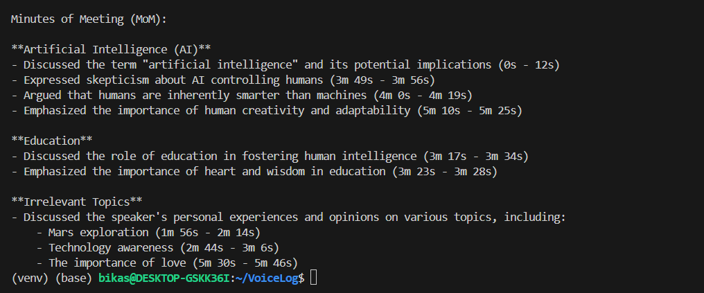

# Minutes of Meetings from Audio and Video


An automated solution for generating meeting minutes from audio and video files using state-of-the-art (SOTA) AI technologies. This project utilizes OpenAI's Whisper for transcription and LLM for generating structured meeting summaries.<br>
<h6>Example of the MOM</h6>




<h3>Features</h3>
<ol>
  
  <li>
    <b>Automatic Transcription:</b> Converts audio and video recordings into text using Whisper, a robust speech-to-text model.
  </li>
  <li>
    <b>Structured Summarization:</b> Summarizes transcriptions into coherent meeting minutes using LLM.
  </li>
  <li>
    <b>User-Friendly Interface:</b> Designed to be accessible and easy to use for non-technical users.
  </li>
</ol>
<h3>Requirements</h3>

To use this project, ensure the following dependencies are installed:

```bash
Python=3.10.15
google-generativeai 
python-dotenv 
```

<h3>Setup and Installation</h3>

<h3>Clone this repository:</h3>

```bash
git clone https://github.com/polok-dev98/Minutes-of-meetings-from-audio-and-video
```

<h3>Install the required libraries:</h3>

```bash
conda create -p venv python=3.10.15
conda activate ./venv
pip install -r requirements.txt
```

<h3>Contribution</h3>

Contributions are welcome! Feel free to fork the repository, create a new branch, and submit a pull request.

<h3>License</h3>

<h3>Contribution</h3>

Author : Asif Pervez Polok

<h3>License</h3>

This project is open-source and licensed under the MIT License.

<h3>Contact</h3>

For any questions or suggestions, please contact the repository owner through GitHub.

